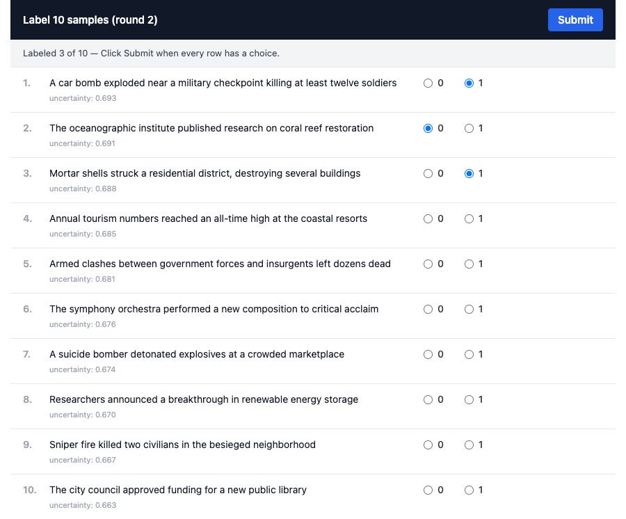
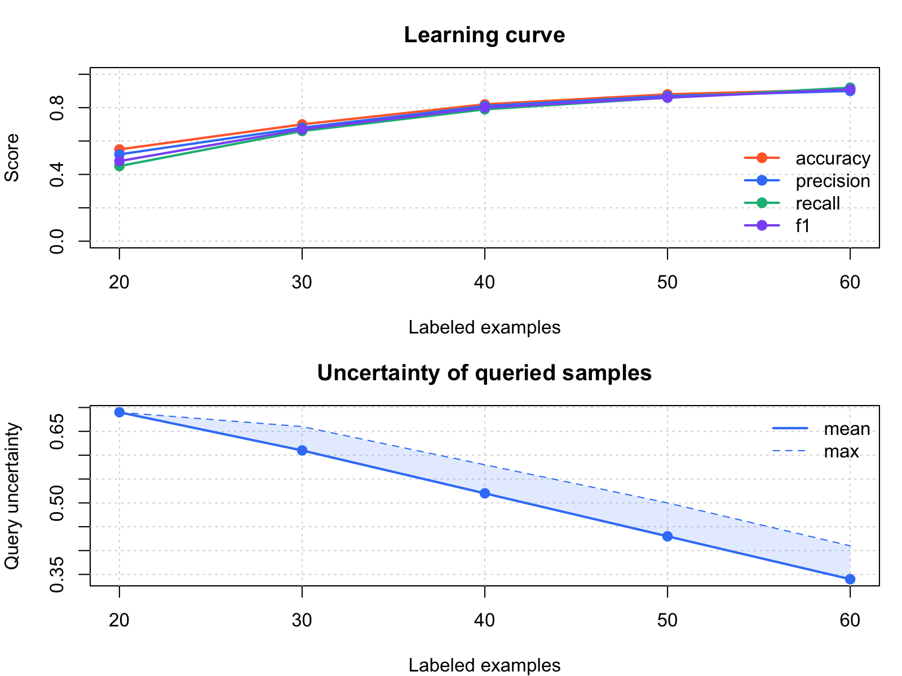

# conflibertR

<!-- badges: start -->
[](https://github.com/shreyasmeher/conflibertR/actions/workflows/R-CMD-check.yaml)
<!-- badges: end -->

R interface to [ConfliBERT](https://github.com/eventdata/ConfliBERT), a pretrained language model for conflict and political violence text analysis.

**Inference:** Named Entity Recognition, Binary Classification, Multilabel Classification, Question Answering.

**Training:** Fine-tune custom classifiers on your own data with any of 7 base models, and compare their performance side by side.

**Active Learning:** Iteratively label an unlabeled pool by focusing on the most uncertain samples, with a built-in Shiny gadget for point-and-click labeling, plus diversity-aware batch selection.

**Parameter-efficient training:** LoRA fine-tuning cuts GPU memory ~5× so bigger models run on modest hardware.

## Installation

```r
# install.packages("devtools")
devtools::install_github("shreyasmeher/conflibertR")
```

## One-time setup

Install the Python dependencies (torch, transformers, and friends). As of 0.5.0 the backend is PyTorch-only (no TensorFlow), so the install is smaller and far more reliable:

```r
library(conflibertR)

conflibert_install()   # picks conda if available, else virtualenv

# Restart R after this completes
```

One caveat: the published QA checkpoint only ships TensorFlow weights.
`conflibert_qa()` converts them to PyTorch on first use and caches the
result; that one-time conversion needs TensorFlow. If you plan to use QA
on a fresh setup, run `conflibert_install(qa = TRUE)` instead (existing
0.4.0 environments already have TensorFlow, so it just works).

If anything looks off later, run the built-in diagnostic:

```r
conflibert_status()
#> ── conflibertR status ─────────────────────────────────
#> ✔ Found conda environment "conflibert"
#> ✔ Python: /opt/miniconda3/envs/conflibert/bin/python
#> ✔ Python package torch
#> ✔ Python package transformers
#> ...
#> ✔ Everything looks good.
```

## Inference

```r
library(conflibertR)
```

### Named Entity Recognition

```r
conflibert_ner("NATO forces were deployed near Kabul in September.")
#> ── ConfliBERT entities ─────────────── 3 entities in 1 text ──
#>   1. NATO forces were deployed near Kabul in September.
#>      Organisation   NATO       0.99
#>      Location       Kabul      0.99
#>      Temporal       September  0.98
```

Entities are highlighted in color in the console. The result is still a
plain tibble underneath, now with `score` and character offsets
(`start`, `end`) per entity, so everything composes as before:

```r
# Vectorized -- multiple texts at once
ents <- conflibert_ner(c(
  "The UN Security Council met in New York.",
  "Soldiers from the 4th Brigade advanced."
))
dplyr::filter(ents, label == "Location")
```

### Binary Classification

```r
conflibert_classify("A bomb exploded in the crowded market.")
#> # A tibble: 1 x 6
#>   text                                   label    class confidence prob_negative prob_positive
#>   <chr>                                  <chr>    <int>      <dbl>         <dbl>         <dbl>
#> 1 A bomb exploded in the crowded market. Positive     1      0.98          0.02          0.98

# Vectorized
conflibert_classify(c(
  "Government troops clashed with rebels.",
  "The weather was sunny and warm."
))
```

### Multilabel Classification

```r
conflibert_multilabel("Insurgents kidnapped two aid workers near the border.")
#> # A tibble: 4 x 4
#>   text                      label                probability predicted
#>   <chr>                     <chr>                      <dbl> <lgl>
#> 1 Insurgents kidnapped ...  Armed Assault              0.12  FALSE
#> 2 Insurgents kidnapped ...  Bombing or Explosion       0.05  FALSE
#> 3 Insurgents kidnapped ...  Kidnapping                 0.91  TRUE
#> 4 Insurgents kidnapped ...  Other                      0.08  FALSE
```

### Question Answering

```r
conflibert_qa(
  context  = "The ceasefire was signed in Geneva on March 15th by both parties.",
  question = "Where was the ceasefire signed?"
)
#> [1] "Geneva"

# Vectorized, with confidence scores and answer spans:
conflibert_qa(
  context  = "The ceasefire was signed in Geneva on March 15th by both parties.",
  question = c("Where was the ceasefire signed?",
               "When was the ceasefire signed?"),
  details  = TRUE
)
#> # A tibble: 2 x 6
#>   question                        answer     score start   end context
#>   <chr>                           <chr>      <dbl> <int> <int> <chr>
#> 1 Where was the ceasefire signed? Geneva      0.97    29    34 The ceasefire...
#> 2 When was the ceasefire signed?  March 15th  0.95    39    48 The ceasefire...
```

## Benchmarking

Evaluate the pretrained binary classifier against your own labeled data:

```r
conflibert_benchmark(
  texts  = my_data$text,
  labels = my_data$label
)
#> # A tibble: 1 x 5
#>   accuracy precision recall    f1     n
#>      <dbl>     <dbl>  <dbl> <dbl> <int>
#> 1    0.85      0.83   0.87  0.85   200
```

## Example Datasets

The package bundles small synthetic datasets for quick testing:

```r
# Binary: conflict vs non-conflict (80 train / 20 dev / 20 test)
data <- conflibert_example("binary")

# Multiclass: 4 event types (80 train / 20 dev / 20 test)
data <- conflibert_example("multiclass")

# Active learning: 20 labeled seed + 61 unlabeled pool + 20 dev
data <- conflibert_example("active")

data$train
#> # A data.frame: 80 x 2
#>   text                                                                    label
#>   <chr>                                                                   <int>
#> 1 Government forces launched an offensive against rebel positions ...          1
#> 2 The national football team secured a convincing victory ...                  0
#> ...
```

## Fine-tuning

Train a custom classifier on your own data (or use the built-in examples):

```r
data <- conflibert_example("binary")

result <- conflibert_finetune(
  train = data$train,
  dev   = data$dev,
  test  = data$test,
  model = "ConfliBERT",
  task  = "binary",
  epochs = 3
)

result$metrics
#> # A tibble: 1 x 4
#>   accuracy precision recall    f1
#>      <dbl>     <dbl>  <dbl> <dbl>
#> 1    0.92      0.91   0.93  0.92

# Save the trained model for later
result <- conflibert_finetune(
  train = data$train, dev = data$dev, test = data$test,
  model = "RoBERTa Base",
  save_dir = "./my_model"
)

# LoRA: train only a small adapter; cuts GPU memory ~5x
result <- conflibert_finetune(
  train = data$train, dev = data$dev, test = data$test,
  model = "DeBERTa v3 Base",
  use_lora = TRUE, lora_rank = 8,
  save_dir = "./my_lora_model"
)
```

### Loading a saved classifier

Any model saved with `save_dir=` (including LoRA runs; the adapter is
merged before saving) can be reloaded for inference:

```r
clf <- conflibert_load("./my_model")
predict(clf, c("Armed clashes erupted near the border.",
               "The city hosted a jazz festival this weekend."))
#> # A tibble: 2 x 5
#>   text                                          class confidence prob_0 prob_1
#>   <chr>                                         <int>      <dbl>  <dbl>  <dbl>
#> 1 Armed clashes erupted near the border.            1      0.97   0.03   0.97
#> 2 The city hosted a jazz festival this weekend.     0      0.99   0.99   0.01
```

## Comparing Models

Compare multiple base architectures on the same dataset:

```r
data <- conflibert_example("binary")

comparison <- conflibert_compare(
  train  = data$train,
  dev    = data$dev,
  test   = data$test,
  models = c("ConfliBERT", "BERT Base Uncased", "RoBERTa Base", "ModernBERT Base"),
  task   = "binary",
  epochs = 3
)

comparison
#> # A tibble: 4 x 6
#>   model            accuracy precision recall    f1 runtime
#>   <chr>               <dbl>     <dbl>  <dbl> <dbl>   <dbl>
#> 1 ConfliBERT          0.92      0.91   0.93  0.92    45.2
#> 2 BERT Base Uncased   0.88      0.86   0.89  0.87    42.1
#> 3 RoBERTa Base        0.90      0.89   0.91  0.90    48.3
#> 4 ModernBERT Base     0.93      0.92   0.94  0.93    38.7
```

Comparison results print as a ranked leaderboard and plot directly:

```r
plot(comparison)                # base graphics dot chart
ggplot2::autoplot(comparison)   # ggplot2 version
```

## Plots

Every result object plots itself, all in one consistent theme:

```r
plot(result)                  # fine-tune result -> confusion matrix
plot(ml)                      # multilabel result -> probability bars
plot(session)                 # active learning -> learning curve + uncertainty

# ggplot2 versions (returns a ggplot you can customize further):
ggplot2::autoplot(result)
ggplot2::autoplot(comparison)
ggplot2::autoplot(session)

# and the theme is exported for your own figures:
ggplot2::ggplot(df, ggplot2::aes(x, y)) +
  ggplot2::geom_point() +
  theme_conflibert()
```

### Available models

```r
conflibert_models()
#> [1] "ConfliBERT"        "BERT Base Uncased" "BERT Base Cased"
#> [4] "RoBERTa Base"      "ModernBERT Base"   "DeBERTa v3 Base"
#> [7] "DistilBERT Base"
```

## Active Learning

Labeling text is expensive. Active learning trains a model on a tiny
labeled seed, then asks you to label only the *most uncertain* samples
from an unlabeled pool: the ones a new label will help the model most.

```r
data <- conflibert_example("active")

# 1. Train on the seed, get the first uncertain batch
session <- conflibert_active_start(
  seed       = data$seed,    # small labeled set
  pool       = data$pool,    # unlabeled texts
  dev        = data$dev,     # tracks metrics each round
  strategy   = "entropy",    # or "margin" / "least_confidence"
  diverse    = TRUE,         # cluster candidates to avoid near-duplicates
  query_size = 10,
  use_lora   = TRUE          # optional: parameter-efficient training
)

session
#> Active learning session  (round 1)
#>   Model: ConfliBERT  |  Task: binary  |  Strategy: entropy
#>   Labeled: 20  |  Pool remaining: 51  |  Query size: 10

session$query   # tibble: 10 texts + uncertainty scores

# 2. Label the query; easiest route is the built-in Shiny gadget
labels  <- conflibert_active_label(session)
session <- conflibert_active_next(session, labels)
```



```r

# 3. Iterate until the pool is drained or metrics plateau
while (!session$done) {
  labels  <- conflibert_active_label(session)   # or your own vector
  session <- conflibert_active_next(session, labels)
}

# 4. Inspect progress
session$metrics            # tibble with per-round F1, accuracy, uncertainty, ...
plot(session)              # two-panel: learning curve + uncertainty trend

# 5. Save the trained model as a HuggingFace checkpoint
conflibert_active_save(session, "my_al_model")
```



`conflibert_active_label()` opens a modal dialog (or browser tab) with
the queried texts + radio buttons per class; requires the `shiny` and
`miniUI` packages. If you'd rather label in code, just pass an integer
vector in the same order as `session$query`:

```r
labels  <- c(1, 0, 1, 0, 0, 1, 0, 1, 0, 1)
session <- conflibert_active_next(session, labels)
```

For a full walkthrough, see `vignette("active-learning", package = "conflibertR")`.

## How it works

The package uses [reticulate](https://rstudio.github.io/reticulate/) to call HuggingFace Transformers models via Python. Models are downloaded from HuggingFace Hub on first use and cached locally. No GPU is required (CPU works fine), and CUDA is used automatically when available. Run `conflibert_status()` to see your setup.

## Citations

Brandt, P.T., Alsarra, S., D'Orazio, V., Heintze, D., Khan, L., Meher, S., Osorio, J. and Sianan, M., 2025. Extractive versus Generative Language Models for Political Conflict Text Classification. *Political Analysis*, pp.1-29.

Hu, Y., Hosseini, M., Parolin, E.S., Osorio, J., Khan, L., Brandt, P. and D’Orazio, V., 2022, July. Conflibert: A pre-trained language model for political conflict and violence. In Proceedings of the 2022 conference of the north American chapter of the association for computational linguistics: human language technologies (pp. 5469-5482).
